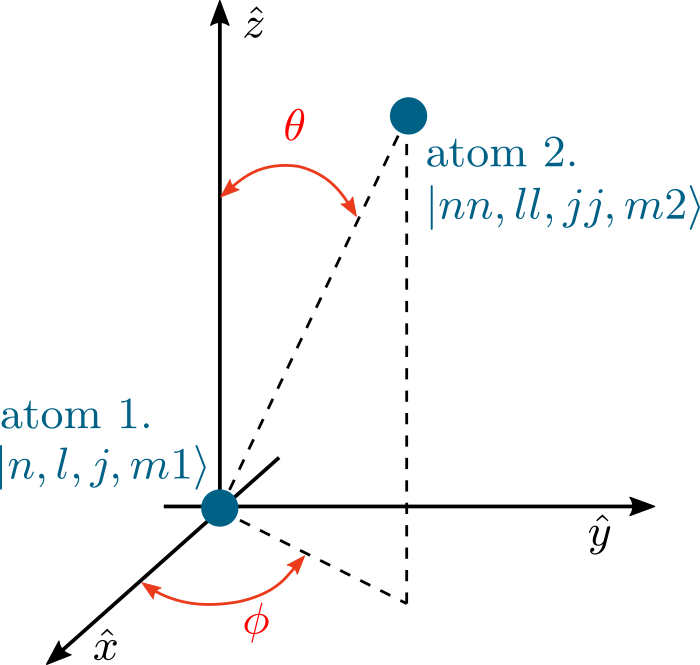

Pair-state basis calculations
=============================

Preliminaries
--------------

Relative orientation of the two atoms can be described with two polar angles
:math:`\theta` and :math:`\phi` giving polar and azimuth angle. The :math:`\hat{z}`
axis is here specified relative to the laser driving. For circularly polarized
laser light, this is the direction of laser beam propagation. For linearly
polarized light, this is the plane of the electric field polarization,
perpendicular to the laser direction.

Internal coupling between the two atoms in :math:`|n,l,j,m_1\rangle` and
:math:`|nn,ll,jj,m_2\rangle` is calculated easily for the two atoms positioned
so that :math:`\theta = 0`, and for other angles wignerD matrices are used to change a basis and perform calculation in the basis where couplings are more clearly seen.

Overview
--------

.. currentmodule:: arc.calculations_atom_pairstate

.. rubric:: PairStateInteractions Methods

.. autosummary::

    PairStateInteractions.defineBasis
    PairStateInteractions.getC6perturbatively
    PairStateInteractions.getLeRoyRadius
    PairStateInteractions.diagonalise
    PairStateInteractions.plotLevelDiagram
    PairStateInteractions.showPlot
    PairStateInteractions.exportData
    PairStateInteractions.getC6fromLevelDiagram
    PairStateInteractions.getC3fromLevelDiagram
    PairStateInteractions.getVdwFromLevelDiagram

.. rubric:: StarkMapResonances Methods

.. autosummary::

    StarkMapResonances.findResonances
    StarkMapResonances.showPlot

Detailed documentation
----------------------

.. automodule:: arc.calculations_atom_pairstate
   :members:
