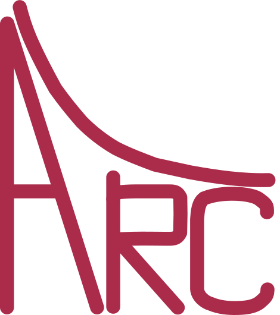
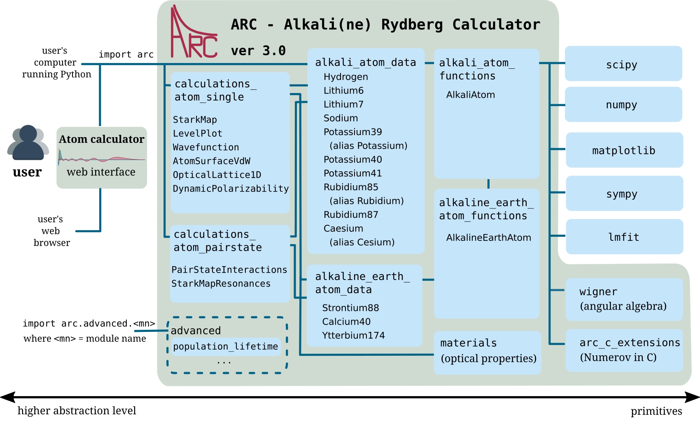

.. Atom calculator documentation master file, created by
   sphinx-quickstart on Fri Jul 29 12:19:10 2016.
   You can adapt this file completely to your liking, but it should at least
   contain the root `toctree` directive.

*****************
ARC documentation
*****************

ARC (Alkali Rydberg Calculator)  is package of routines written in Python, using object-oriented programming (OOP) to make modular, reusable and extendable collection of routines and data for performing useful calculations of single atom and two-atom properties, like level diagrams, interactions and transition strengths for alkali metal atoms.

Contents
========

.. toctree::
   :maxdepth: 2

   installation
   getting_started
   detailed_doc
   contribute

Package structure
=================

    Overview of modules and interdependencies in the :obj:`arc` package. Click on image to enlarge.

Indices and tables
==================

* :ref:`genindex`
* :ref:`modindex`
* :ref:`search`

Credits
=======

:Authors:
    Nikola Šibalić,
    Jonathan D. Pritchard,
    Charles S. Adams,
    Kevin J. Weatherill

:Licence: BSD 3-Clause

:Version: 1.2.0 of 2017/06/10
