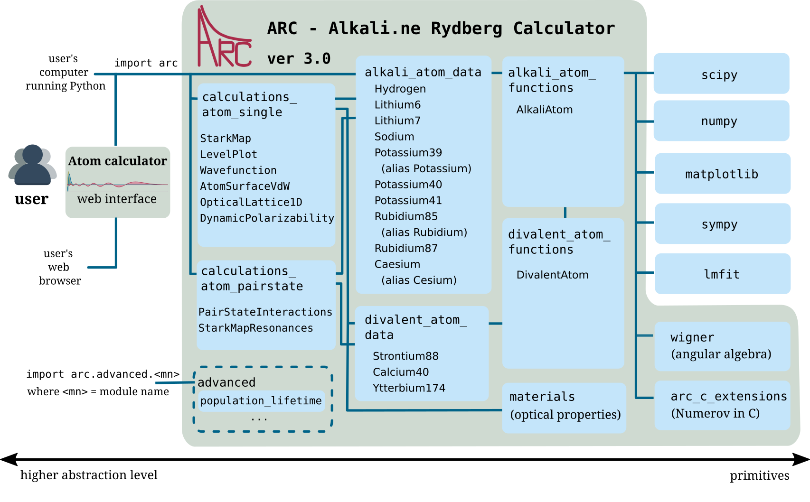

.. Atom calculator documentation master file, created by
   sphinx-quickstart on Fri Jul 29 12:19:10 2016.
   You can adapt this file completely to your liking, but it should at least
   contain the root `toctree` directive.

*****************
ARC documentation
*****************

.. figure:: ./logo.png
    :width: 94px
    :align: right
    :height: 106px
    :alt: ARC logo
    :figclass: align-right

ARC (Alkali.ne Rydberg Calculator)  is package of routines written in Python,
using object-oriented programming (OOP) to make modular, reusable and extendable
collection of routines and data for performing useful calculations of
single atom and two-atom properties, like level diagrams, interactions and
transition strengths for alkali and divalent atoms.

Contents
========

.. toctree::
   :maxdepth: 2

   installation
   getting_started
   detailed_doc
   contribute

.. note::
    ARC 3.0 added support for divalent atoms and some of the functions
    (`Wavefunction`, `AtomSurfaceVdW`,
    `OpticalLattice1D`, `DynamicPolarizability`, and optical materials
    properties).
    See more at E. J. Robertson, N. Šibalić, R. M. Potvliege, M. P. A. Jones,
    ARC 3.0: An expanded Python toolbox for atomic physics calculations,
    *Computer Physics Communications* **261**, 107814 (2021) `https://doi.org/10.1016/j.cpc.2020.107814 <https://doi.org/10.1016/j.cpc.2020.107814>`_

Package structure
=================

    Overview of modules and interdependencies in the :obj:`arc` package. Click on image to enlarge.

Indices and tables
==================

* :ref:`genindex`
* :ref:`modindex`
* :ref:`search`

Credits
=======

:Authors:
    Nikola Šibalić,
    Elizabeth J. Robertson,
    Jonathan D. Pritchard,
    Robert M. Potvliege,
    Matthew P. A. Jones,
    Charles S. Adams,
    Kevin J. Weatherill,
    and `contributors <https://github.com/nikolasibalic/ARC-Alkali-Rydberg-Calculator/graphs/contributors>`_.

:Cite as:
  The simplest way to obtain correct reference(s), given the number of contributions,
  is to **call - at the end of your Python script that uses ARC - following function**::
    
    from arc import *
    # use ARC
    print(getCitationForARC())

  The ``getCitationForARC()`` will print references that introduced methods
  you used into ARC library. Otherwise, you can do manual decision making
  based on the logic below:

  If you use **alkali** atoms:

  N. Šibalić, J. D. Pritchard, K. J. Weatherill, C. S. Adams,
  ARC: An open-source library for calculating properties of alkali Rydberg atoms,
  *Computer Physics Communications* **220**, 319 (2017)
  `https://doi.org/10.1016/j.cpc.2017.06.015 <https://doi.org/10.1016/j.cpc.2017.06.015>`_

  If you use **divalent** atoms or new features introduced in ARC 3.0:

  E. J. Robertson, N. Šibalić, R. M. Potvliege, M. P. A. Jones,
  ARC 3.0: An expanded Python toolbox for atomic physics calculations,
  *Computer Physics Communications* **261**, 107814 (2021) `https://doi.org/10.1016/j.cpc.2020.107814 <https://doi.org/10.1016/j.cpc.2020.107814>`_

  In addition, if you use ``arc_advanced`` extensions check
  `arc.advanced <./advanced.html>`_ .

  In addition, if you use AC Stark calculations ``ShirleyMethod`` or ``RWAStarkShift``
  please also cite D. H. Meyer, Z. A. Castillo, K. C. Cox, P. D. Kunz, J. Phys. B: At. Mol. Opt. Phys., 53, 034001 (2020) `https://doi.org/10.1088/1361-6455/ab6051 <https://doi.org/10.1088/1361-6455/ab6051>`_. 

:Licence: BSD 3-Clause

:Version: 3.3.0 of 2023/04/23
